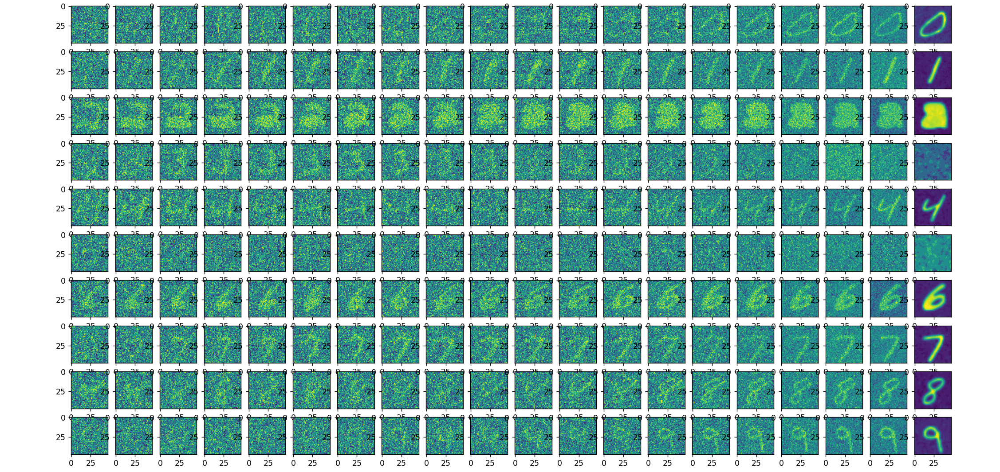

# pytorch-diffusion

手写数字数据集的diffusion图像生成，支持用分类ID引导生成指定数字

## 训练效果

```
epoch:0 loss=0.09367454051971436
epoch:1 loss=0.08872738480567932
epoch:2 loss=0.07516557723283768
epoch:3 loss=0.06611064076423645
epoch:4 loss=0.0668148323893547
epoch:5 loss=0.07564781606197357
epoch:6 loss=0.06627427041530609
epoch:7 loss=0.06185731664299965
epoch:8 loss=0.06242090463638306
epoch:9 loss=0.06153980270028114
epoch:10 loss=0.05845785513520241
epoch:11 loss=0.05370307341217995
epoch:12 loss=0.05589013174176216
epoch:13 loss=0.057146105915308
epoch:14 loss=0.05727981775999069
epoch:15 loss=0.049735818058252335
epoch:16 loss=0.05287974327802658
epoch:17 loss=0.048421893268823624
epoch:18 loss=0.04815121367573738
epoch:19 loss=0.054195549339056015
epoch:20 loss=0.04814799875020981
epoch:21 loss=0.04964037984609604
epoch:22 loss=0.04809208959341049
epoch:23 loss=0.04784173145890236
epoch:24 loss=0.044943470507860184
epoch:25 loss=0.04372747614979744
epoch:26 loss=0.047794587910175323
epoch:27 loss=0.045284222811460495
epoch:28 loss=0.04716828092932701
epoch:29 loss=0.04249279201030731
epoch:30 loss=0.0484805665910244
epoch:31 loss=0.04517273232340813
epoch:32 loss=0.04286431148648262
epoch:33 loss=0.0415775366127491
epoch:34 loss=0.044873639941215515
epoch:35 loss=0.04109857603907585
epoch:36 loss=0.04397314414381981
epoch:37 loss=0.045988839119672775
epoch:38 loss=0.0408693365752697
epoch:39 loss=0.040605854243040085
epoch:40 loss=0.04187183454632759
epoch:41 loss=0.04328584298491478
epoch:42 loss=0.04206966981291771
epoch:43 loss=0.042049579322338104
epoch:44 loss=0.03962571918964386
epoch:45 loss=0.04218325391411781
epoch:46 loss=0.045767635107040405
epoch:47 loss=0.04328799620270729
epoch:48 loss=0.04084816947579384
epoch:49 loss=0.04190921038389206
epoch:50 loss=0.042815081775188446
epoch:51 loss=0.0385555773973465
epoch:52 loss=0.04020746052265167
epoch:53 loss=0.03904496133327484
epoch:54 loss=0.03913990780711174
epoch:55 loss=0.03791428729891777
epoch:56 loss=0.038833633065223694
epoch:57 loss=0.040748436003923416
epoch:58 loss=0.038732051849365234
epoch:59 loss=0.04364493116736412
epoch:60 loss=0.03879616782069206
epoch:61 loss=0.04526577889919281
epoch:62 loss=0.037386633455753326
epoch:63 loss=0.037982646375894547
epoch:64 loss=0.03987875208258629
epoch:65 loss=0.038053322583436966
epoch:66 loss=0.03936714679002762
epoch:67 loss=0.038860950618982315
epoch:68 loss=0.03833260387182236
epoch:69 loss=0.0384192168712616
epoch:70 loss=0.03793536126613617
epoch:71 loss=0.038762498646974564
epoch:72 loss=0.040717121213674545
epoch:73 loss=0.03743593394756317
epoch:74 loss=0.03939107432961464
epoch:75 loss=0.03890211507678032
epoch:76 loss=0.03750889375805855
epoch:77 loss=0.038216933608055115
epoch:78 loss=0.03754616901278496
epoch:79 loss=0.03699401021003723
epoch:80 loss=0.03747900202870369
epoch:81 loss=0.03875776007771492
epoch:82 loss=0.036669716238975525
epoch:83 loss=0.0362057164311409
epoch:84 loss=0.037177979946136475
epoch:85 loss=0.0386287197470665
epoch:86 loss=0.03745108097791672
epoch:87 loss=0.035838667303323746
epoch:88 loss=0.03874886408448219
epoch:89 loss=0.03735683485865593
epoch:90 loss=0.03665066137909889
epoch:91 loss=0.03970884904265404
epoch:92 loss=0.037125006318092346
epoch:93 loss=0.03512052074074745
epoch:94 loss=0.03688664734363556
epoch:95 loss=0.03524479269981384
epoch:96 loss=0.03926272317767143
epoch:97 loss=0.036016158759593964
epoch:98 loss=0.03794339671730995
epoch:99 loss=0.037227191030979156
epoch:100 loss=0.03673290088772774
epoch:101 loss=0.03483697026968002
epoch:102 loss=0.038553137332201004
epoch:103 loss=0.037967342883348465
epoch:104 loss=0.033836644142866135
epoch:105 loss=0.03644904866814613
epoch:106 loss=0.03620164841413498
epoch:107 loss=0.037461355328559875
epoch:108 loss=0.037306372076272964
epoch:109 loss=0.0383845716714859
epoch:110 loss=0.03473557159304619
epoch:111 loss=0.0360155887901783
epoch:112 loss=0.037127867341041565
epoch:113 loss=0.03884747251868248
epoch:114 loss=0.03486650809645653
epoch:115 loss=0.034917399287223816
epoch:116 loss=0.03442040830850601
epoch:117 loss=0.037376388907432556
epoch:118 loss=0.03415631130337715
epoch:119 loss=0.034467242658138275
epoch:120 loss=0.03787562623620033
epoch:121 loss=0.03824310377240181
epoch:122 loss=0.03426727280020714
epoch:123 loss=0.03559662029147148
epoch:124 loss=0.034789443016052246
epoch:125 loss=0.036057088524103165
epoch:126 loss=0.033968184143304825
epoch:127 loss=0.034011874347925186
epoch:128 loss=0.03501100093126297
epoch:129 loss=0.034487612545490265
epoch:130 loss=0.03293808922171593
epoch:131 loss=0.03524317964911461
epoch:132 loss=0.03606180101633072
epoch:133 loss=0.03861376270651817
epoch:134 loss=0.03357643261551857
epoch:135 loss=0.035601940006017685
epoch:136 loss=0.03599358722567558
epoch:137 loss=0.03669115528464317
epoch:138 loss=0.03771153464913368
epoch:139 loss=0.03636263683438301
epoch:140 loss=0.037684496492147446
epoch:141 loss=0.03500496596097946
epoch:142 loss=0.035157471895217896
epoch:143 loss=0.03328583762049675
epoch:144 loss=0.033992815762758255
epoch:145 loss=0.034569159150123596
epoch:146 loss=0.032364796847105026
epoch:147 loss=0.033583834767341614
epoch:148 loss=0.0324256494641304
epoch:149 loss=0.03645392879843712
epoch:150 loss=0.03714875131845474
epoch:151 loss=0.035763125866651535
epoch:152 loss=0.034584891051054
epoch:153 loss=0.03313685953617096
epoch:154 loss=0.03428370878100395
epoch:155 loss=0.03502508997917175
epoch:156 loss=0.03611355274915695
epoch:157 loss=0.03500016778707504
epoch:158 loss=0.0349695198237896
epoch:159 loss=0.03749793395400047
epoch:160 loss=0.03525347262620926
epoch:161 loss=0.03660665079951286
epoch:162 loss=0.03322933241724968
epoch:163 loss=0.033140361309051514
epoch:164 loss=0.03343517705798149
epoch:165 loss=0.03476928547024727
epoch:166 loss=0.03314348682761192
epoch:167 loss=0.0333263985812664
epoch:168 loss=0.03442295640707016
epoch:169 loss=0.03410166874527931
epoch:170 loss=0.03464585915207863
epoch:171 loss=0.03307883068919182
epoch:172 loss=0.03434787318110466
epoch:173 loss=0.033934805542230606
epoch:174 loss=0.03369530290365219
epoch:175 loss=0.03294972702860832
epoch:176 loss=0.035837724804878235
epoch:177 loss=0.035677727311849594
epoch:178 loss=0.03211052343249321
epoch:179 loss=0.03525029495358467
epoch:180 loss=0.033026374876499176
epoch:181 loss=0.03467435762286186
epoch:182 loss=0.033783476799726486
epoch:183 loss=0.03337103873491287
epoch:184 loss=0.03317328169941902
epoch:185 loss=0.03287879377603531
epoch:186 loss=0.03362761437892914
epoch:187 loss=0.0347357839345932
epoch:188 loss=0.0342991016805172
epoch:189 loss=0.03391407057642937
epoch:190 loss=0.03683505207300186
epoch:191 loss=0.03795667365193367
epoch:192 loss=0.03495040908455849
epoch:193 loss=0.034872621297836304
epoch:194 loss=0.0343380831182003
epoch:195 loss=0.033570654690265656
epoch:196 loss=0.03375042602419853
epoch:197 loss=0.03282016143202782
epoch:198 loss=0.03280553221702576
epoch:199 loss=0.03433068096637726
```




## TODO

推理有概率生不出来相应的数字，还得研究是什么原因